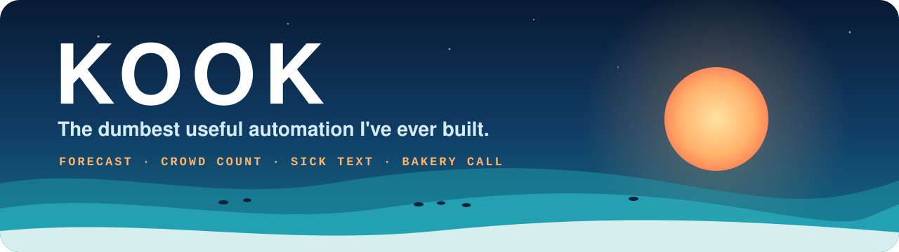
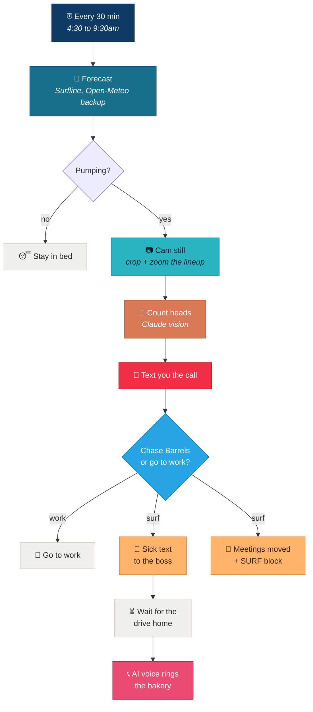

<p align="center">
  
</p>

<p align="center">
  <b>It checks the surf, counts the crowd on the beach cam, and if it's pumping,<br>
  calls in sick for you and gets an AI voice to ring the bakery on the drive home.</b>
</p>

<p align="center">
  
  
  
  
  
  
</p>

---

Every 30 minutes from 4:30 to 9:30am, Kook reads the forecast for your breaks. When it's
**3ft or bigger, 12 knots or less and not onshore before 10am**, it grabs a still off the beach
cam, zooms into the lineup and has Claude count the heads. It texts you the call, then asks on
Telegram: **Chase Barrels** or **Go to work**.

Tap **Chase Barrels** and it texts your boss that you're feeling a bit off, moves today's meetings
to tomorrow, blocks the session out in your calendar and, as you start the drive home, gets an AI
voice to ring your local bakery for a pie and a custard tart.

This is what lands on your phone. A real run, off the Trigg Point cam in Perth:

```
KOOK: Six out. Onshore. Worth it. Get up.
Go Trigg Point! Best at 1:40pm.
Trigg 2.8ft, 7kn onshore (Open-Meteo)

Trigg Point: 6 out
```



---

## The three workflows

| | File | Trigger | What it does |
|---|---|---|---|
| 🏄 | `workflows/1-kook-local-surf-agent.json` | Every 30 min, 4:30 to 9:30am, or **Run it now** | The whole morning: forecast, crowd count, the text, the Telegram buttons, the sick text, the calendar, the bakery call |
| 📞 | `workflows/2-kook-bakery-voice-call.json` | Called by the other two | Places the call with ElevenLabs, or Bland as the backup |
| 🧪 | `workflows/3-kook-test-bakery-call.json` | Manual | Rings **your own** phone, so you hear the voice before it ever rings a real bakery |

The bakery call is its own workflow so you can test it, swap voice providers, or reuse it for
something else without touching the surf logic.

---

## What's real and what isn't

Worth being straight about, because most "automation" demos quietly aren't.

**Genuinely real:**
- **The forecast.** Surfline has no public API, so Kook reads it through a relay. When the relay
  breaks, it quietly falls back to [Open-Meteo](https://open-meteo.com), which is free and keyless.
- **The crowd count.** A real still off a real beach cam, cropped to the strip of water the lineup
  sits in, zoomed 2x and counted by Claude. At full frame a surfer is a few pixels and it counts low;
  cropped, it landed within a couple of a hand count. The number moves a little between runs,
  because surfers do.
- **The texts, the Telegram buttons and the calendar.** Twilio, the Telegram Bot API and Google Calendar.
- **The phone call.** An AI voice actually rings the number you set.

**Not an API call, and here's why:**
- **Ordering the pie.** Your local bakery doesn't have an API. It has a phone, so Kook uses a voice
  agent to ring it like a person would.
- **Knowing how busy it is.** There's no crowd API either, which is why it counts heads off the cam itself.

---

## Setup

**1. Import the bakery call first**

In n8n: **Workflows → Import from File** → `2-kook-bakery-voice-call.json`. Save it.

**2. Import the other two**

Import `1-kook-local-surf-agent.json` and `3-kook-test-bakery-call.json`. In each, open the
**Call the bakery** node and pick the bakery call workflow from the list.

**3. Connect your credentials**

No keys ship in these files. Add your own under **Credentials → New** and attach them:

| | Credential | Used by |
|---|---|---|
| 📱 | Twilio API | **Text me the call**, **Sick text to the boss** |
| 💬 | Telegram API | every Telegram node, including the **Chase Barrels** buttons |
| 🧠 | Anthropic API | **Count heads (Claude vision)** |
| 📅 | Google Calendar OAuth2 | **Today's meetings**, **Move each to tomorrow**, **Book the SURF block** |
| 🗣️ | Header Auth: name `xi-api-key`, value your ElevenLabs key | **Call via ElevenLabs** |
| ☎️ | Header Auth: name `authorization`, value your Bland key | **Call via Bland (backup)** |

You only need the voice provider you actually use.

**4. Fill in `Kook settings`**

It's the one node you edit, in the main and test workflows. Search for `YOUR_`:

```js
CUSTOMER_NAME: 'YOUR_NAME',
MY_PHONE: 'YOUR_MOBILE',              // where the call on the surf gets texted
TWILIO_FROM: 'YOUR_TWILIO_NUMBER',
TELEGRAM_CHAT_ID: 'YOUR_TELEGRAM_CHAT_ID',
BOSS_PHONE: 'YOUR_MOBILE',            // leave it as yours until you're feeling brave
CALENDAR_ID: 'YOUR_GOOGLE_CALENDAR_ID',
BAKERY_PHONE: 'YOUR_MOBILE',          // the real bakery, once TEST_MODE is off
VOICE_PROVIDER: 'bland',              // or 'elevenlabs'
```

**5. Point it at your breaks**

```js
SPOTS: [
  { name: 'Trigg', spotId: '584204204e65fad6a7709268', lat: -31.8784, lon: 115.7513, shoreFacing: 270,
    cams: [
      { break: 'Trigg Point', still: 'https://camstills.cdn-surfline.com/.../latest_full.jpg',
        crop: { top: 0.52, bottom: 0.70, zoom: 2 } },
    ] },
],
```

- `spotId` is the long id at the end of the break's Surfline page URL.
- `crop` is the strip of water your lineup sits in, as fractions of the frame height from the top.
  Get it right and the count gets good. `crop: null` counts the whole frame, which reads low.
- No cam at your break? Leave `cams: []` and it goes on the forecast alone.

**6. Set up the ElevenLabs agent** (skip if you use Bland)

Create an agent, pick a calm British voice, connect your Twilio number under **Phone Numbers**,
and copy the agent ID and phone number ID into `Kook settings`.

<details>
<summary><b>System prompt and first message</b></summary>

```
You are Kook, a calm, polite AI assistant with a dry, faintly British manner, a bit like a very capable butler.
You are calling {{bakery_name}} on behalf of {{customer_name}}.
Wait for them to answer. If it is voicemail, end the call without leaving a message.
Order {{order}} for pickup in about {{pickup_minutes}} minutes under the name {{customer_name}}.
If they ask, say you are an AI assistant ordering for {{customer_name}}.
Read the order and pickup time back, thank them and end the call. Keep it short.
```

```
Good morning. I'm calling on behalf of {{customer_name}}. Could I order {{order}} for pickup in {{pickup_minutes}} minutes, please?
```

</details>

**7. Test it, then go live**

- Leave `TEST_MODE: true`. Every text and call goes to **your** phone, and the drive-home wait is 1 minute.
- Run **Test the bakery call** first, to hear the voice.
- Then run the main workflow with `FORCE_FIRE: true` and watch the whole thing go, flat surf or not.
- Happy? Set `TEST_MODE: false`, put the real numbers in, and activate the main workflow.

---

## Tune the call

All in `Kook settings`:

```js
MIN_SURF_FT: 3,        // Surfline's scale
MAX_WIND_KT: 12,       // light winds only
FIRST_LIGHT_HOUR: 6,   // don't count a cam that can't see yet
BEFORE_HOUR: 10,       // has to be on before 10am
SESSION_MIN: 90,
TRAVEL_MIN: 20,
```

---

## Costs

Close to free, because the paid bits only run on mornings worth surfing:

| | What | Cost |
|---|---|---|
| 🧠 | **Claude** crowd count | about 1 cent per cam, per count |
| 📱 | **Twilio** texts | a couple of texts per morning it fires |
| 📞 | **Voice** call | a pie order is under a minute. Bland is roughly US$0.09 a minute; ElevenLabs comes out of your plan |
| 🌊 | **Forecast** | free |
| ⚙️ | **n8n** | free self-hosted, or the cloud starter plan |

---

## Be decent

- Tell your bakery it's an AI ringing. The prompt already makes it say so if they ask.
- The sick text is a bit. Don't get yourself sacked.
- Only point it at cams you're allowed to use.

---

## Built by

Aaron at [Mycelium AI](https://myceliumai.com.au). The full build is on YouTube.
If you get this running at your break, I'd love to see it.

MIT licensed. Do what you like with it.
